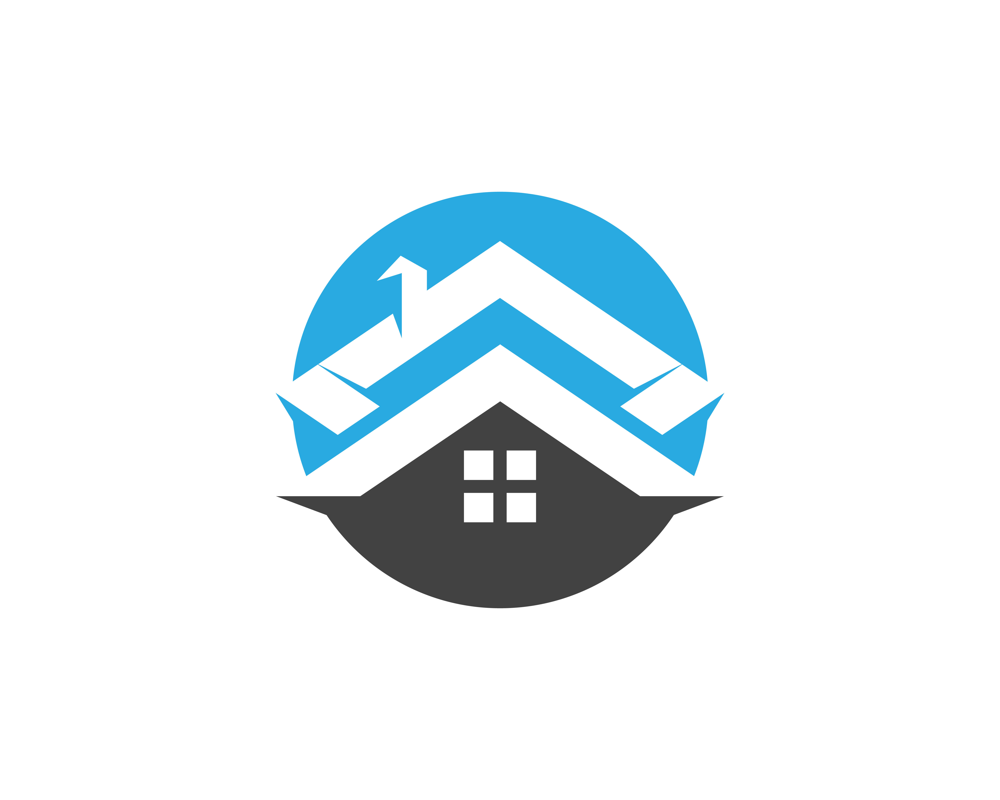

# Real Estate Platform



## Table of Contents
- [About the Project](#about-the-project)
- [Features](#features)
- [Installation](#installation)
- [Usage](#usage)
- [Folder Structure](#folder-structure)
- [Technologies Used](#technologies-used)
- [Colors Scheme](#colors-schemed)
- [Contributing](#contributing)
- [License](#license)
- [Contact](#contact)

## About the Project

This project is a responsive real estate platform built with React. The platform allows users to browse property listings, view detailed information about properties, and contact real estate agents. It features a responsive design, ensuring a seamless user experience across different devices, including desktops and mobile phones.

## Features

- **Responsive Design**: Ensures the website looks great on any device, whether it’s a mobile phone, tablet, or desktop.
- **Property Listings**: Displays a list of available properties with key details.
- **Property Details Page**: Provides detailed information about individual properties.
- **Agent Profiles**: Lists real estate agents and their contact information.
- **Contact Form**: Allows users to get in touch with agents or the platform.
- **Search Functionality**: Users can search for properties based on various criteria.
- **Scroll-to-Top Button**: Smooth scrolling feature that takes users back to the top of the page.

## Installation

Follow these steps to set up the project on your local machine:

1. **Clone the repository**:
    ```bash
    git clone https://github.com/shakeelkhuhro/real-estate-platform.git
    ```

2. **Navigate to the project directory**:
    ```bash
    cd real-estate-platform
    ```

3. **Install dependencies**:
    ```bash
    npm install
    ```

4. **Start the development server**:
    ```bash
    npm start
    ```

    The app should now be running on `http://localhost:3000`.

## Usage

Once the project is set up, you can explore the following features:

- **Home Page**: Browse featured properties and read testimonials.
- **Listings Page**: View a list of all available properties.
- **Property Details Page**: Click on a property to see more detailed information.
- **Agent Profiles**: View and contact real estate agents.
- **Contact Form**: Send inquiries directly to the agents.

## Folder Structure

Here's an overview of the project's folder structure:

```plaintext
src/
│
├── assets/
│   └── images/               # All static images used in the project
│
├── components/
│   ├── Header.js             # The header component with the logo and navigation
│   ├── HeroBanner.js         # Hero banner component with background image
│   ├── PropertyCard.js       # Component to display individual property information
│   ├── PropertyListings.js   # Component to list multiple properties
│   ├── ScrollToTopButton.js  # Scroll-to-top button component
│   ├── Testimonials.js       # Component to display testimonials
│   └── ...                   # Other components ...
│
├── pages/
│   ├── HomePage.js           # The main landing page
│   ├── ListingsPage.js       # Page to display all property listings
│   ├── PropertyPage.js       # Detailed property page
│   ├── AgentsPage.js         # Page to list real estate agents
│   ├── ContactPage.js        # Contact form page
│   ├── LoginPage.js          # User login page
│   ├── RegisterPage.js       # User registration page
│   └── SearchResultsPage.js  # Page to display search results
│
├── App.js                    # Root component of the application
├── index.js                  # Entry point of the application
├── routes.js                 # Defines application routes using React Router
├── contexts/
│   ├── AuthContext.js        # Context for managing user authentication state
│   └── PropertyContext.js    # Context for managing property-related states
│
├── hooks/
│   ├── useAuth.js            # Custom hook for authentication logic
│   └── usePropertyFilters.js # Custom hook for managing property filter logic
│
├── utils/
│   ├── api.js                # API request functions
│   ├── constants.js          # Project-wide constants
│   └── helpers.js            # General helper functions
│
└── styles/
    └── Global.css            # Global CSS styles
```

## Technologies Used

- **React**: JavaScript library for building user interfaces
- **React Router**: For routing between pages
- **Context API**: For state management
- **CSS Flexbox**: For layout and design
- **Git**: Version control system

  ## Color Scheme

This project uses a consistent color scheme to ensure a professional and cohesive look across all pages and components.

- **Primary Color**: `#007bff` (Blue)
  - Used for the header background, buttons, and other primary elements.
  
- **Secondary Color**: `#e0e0e0` (Light Gray)
  - Used for hover states and secondary text.
  
- **Text Color**: `#ffffff` (White)
  - Used for text on dark backgrounds (e.g., header, buttons).
  
- **Background Color**: `#f8f9fa` (Light Background)
  - Used for the main background to create contrast with content areas.
  
- **Accent Color**: `#0056b3` (Darker Blue)
  - Used for interactive elements like links when hovered or focused.

These colors ensure readability and a pleasant user experience while maintaining the brand identity of the platform.


## Contributing

Contributions are welcome! If you'd like to contribute, please fork the repository and use a feature branch. Pull requests are warmly welcomed.

1. Fork the repository
2. Create your feature branch (`git checkout -b feature/AmazingFeature`)
3. Commit your changes (`git commit -m 'Add some AmazingFeature'`)
4. Push to the branch (`git push origin feature/AmazingFeature`)
5. Open a Pull Request

## License

This project is licensed under the MIT License - see the [LICENSE](LICENSE) file for details.

## Contact

If you have any questions or need further assistance, feel free to contact me:

- **Email**: shakeelahmedkhu.com
- **GitHub**: [ShakeelKhuhro](https://github.com/shakeelkhuhro)

```
